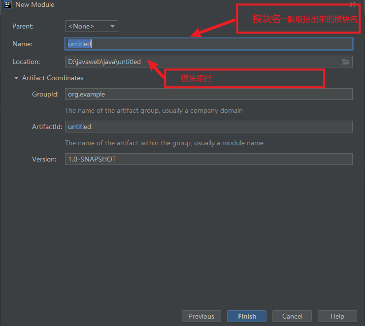
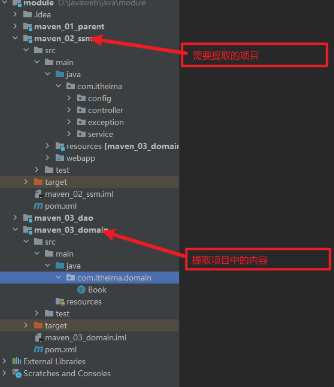
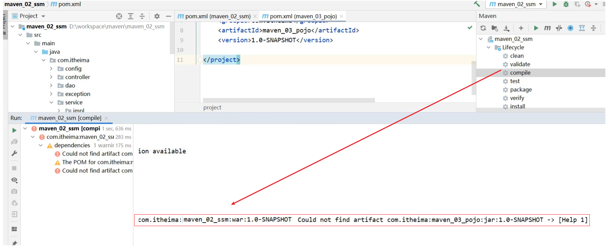
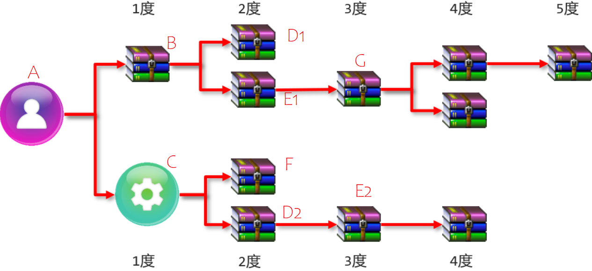
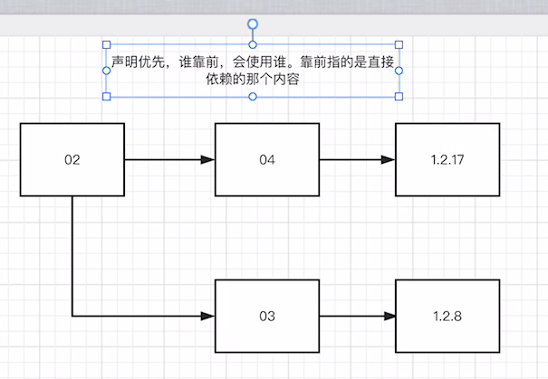
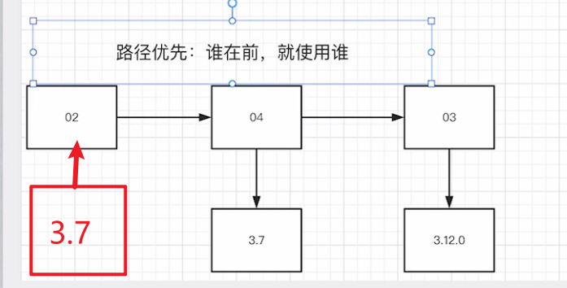

# 分模式开发
## 模块抽取
```markdown
创建新模块——>提取原本项目中要分出来的内容——>删除原项目中的内容
```
### 创建新模块

### 提取项目要分出来的内容

## 创建依赖关系
```markdown
因为在一个项目中，每个人负责的模块可能不同，导致需要将项目分为几个模块，但各个模块之间又需要联系，这时候怎么办呢？
这时便需要在maven中加入需要的以下依赖即可，在分离出来的模块中也需要加入模块需要的maven配置
```
```xml
<dependency>
    <groupId>com.itheima</groupId>
    <artifactId>maven_03_domain</artifactId>
    <version>1.0-SNAPSHOT</version>
</dependency>
```
## 将依赖导入本地仓库
    在maven中加入上面依赖的时候，当程序运行，便会出现以下错误

```markdown
错误信息为：不能解决`maven_02_ssm`项目的依赖问题，找不到`maven_03_pojo`这个jar包。
为什么找不到呢?

原因是Maven会从本地仓库找对应的jar包，但是本地仓库又不存在该jar包所以会报错。
在IDEA中是有`maven_03_pojo`这个项目，所以我们只需要将`maven_03_pojo`项目安装到本地仓库即可。
可以在本地仓库中去查看是否生成？
具体安装在哪里，和你们自己电脑上Maven的本地仓库配置的位置有关。
当再次执行`maven_02_ssm`的compile的命令后，就已经能够成功编译。
```
# 依赖管理
## 什么是依赖
```xml
<!--设置当前项目所依赖的所有jar-->
<dependencies>
    <!--设置具体的依赖-->
    <dependency>
        <!--依赖所属群组id-->
        <groupId>org.springframework</groupId>
        <!--依赖所属项目id-->
        <artifactId>spring-webmvc</artifactId>
        <!--依赖版本号-->
        <version>5.2.10.RELEASE</version>
    </dependency>
</dependencies>
```
## 依赖传递

```markdown
说明: A代表自己的项目；B,C,D,E,F,G代表的是项目所依赖的jar包；D1和D2 E1和E2代表是相同jar包的不同版本

(1) A依赖了B和C,B和C有分别依赖了其他jar包，所以在A项目中就可以使用上面所有jar包，这就是所说的依赖传递
(2) 依赖传递有直接依赖和间接依赖
    相对于A来说，A直接依赖B和C,间接依赖了D1,E1,G，F,D2和E2
    对于B来说，B直接依赖了D1和E1,间接依赖了G
    接依赖和间接依赖是一个相对的概念
```
## 依赖冲突
    因为有依赖传递的存在，就会导致同一个jar包，却有着不同版本，因而造成了类包版本冲突
    冲突分为：特殊优先  路径优先  声明优先
### 特殊优先
    当同级配置了相同资源的不同版本，后配置的会覆盖先配置的，以下会显示4.12版本
```xml
<dependencies>
    <dependency>
      <groupId>junit</groupId>
      <artifactId>junit</artifactId>
      <version>4.12</version>
      <scope>test</scope>
    </dependency>

    <dependency>
      <groupId>junit</groupId>
      <artifactId>junit</artifactId>
      <version>4.11</version>
      <scope>test</scope>
    </dependency>
</dependencies>
```
### 路径优先
    当依赖中出现相同的资源时，层数越深，优先级越低，层数越浅，优先级越高

### 声明优先

## 可选依赖
    当我们不想让别看见我们所依赖的包的时候便可以在指定配置下加入<optional>true</optional>这句话
```xml
<dependency>
    <groupId>com.itheima</groupId>
    <artifactId>maven_03_pojo</artifactId>
    <version>1.0-SNAPSHOT</version>
    <!--可选依赖是隐藏当前工程所依赖的资源，隐藏后对应资源将不具有依赖传递-->
    <optional>true</optional>
</dependency>
```
## 排除依赖
    当我们不知道别人使用的依赖版本的时候，我们可以使用排除依赖将别人的版本干掉换成我们的，这边排除不需要写版本号
使用方法

    在指定指定配置文件加入
```xml
    <exclusions>
        <exclusion>
            <groupId>com.itheima</groupId>
            <artifactId>排除的配置</artifactId>
        </exclusion>
    </exclusions>
```
```xml
<!--例如-->
<dependency>
    <groupId>com.itheima</groupId>
    <artifactId>maven_04_dao</artifactId>
    <version>1.0-SNAPSHOT</version>
    <!--排除依赖是隐藏当前资源对应的依赖关系-->
    <exclusions>
        <exclusion>
            <groupId>com.itheima</groupId>
            <artifactId>maven_03_pojo</artifactId>
        </exclusion>
    </exclusions>
</dependency>
```
# 聚合与继承
## 聚合
### 为什么要聚合
```markdown
如果项目多的话，一个个操作项目就容易出现漏掉或重复操作的问题， 所以我们就想能不能抽取一个项目，把所有的项目管理起来，
以后我们要想操作这些项目，只需要操作这一个项目，其他所有的项目都走一样的流程，这个不就很省事省力。
```
### 什么是聚合
* 所谓聚合:将多个模块组织成一个整体，同时进行项目构建的过程称为聚合
* 聚合工程：通常是一个不具有业务功能的"空"工程（有且仅有一个pom文件）
* 作用：使用聚合工程可以将多个工程编组，通过对聚合工程进行构建，实现对所包含的模块进行同步构建
    * 当工程中 某个模块发生更新（变更）时，必须保障工程中与已更新模块关联的模块同步更新，此时可以使用聚合工程来解决批量模块同步构建的问题。
### 步骤
1. 创建一个新工程
2. 将新工程设为父项目，打包方式为pom
```xml
<?xml version="1.0" encoding="UTF-8"?>
<project xmlns="http://maven.apache.org/POM/4.0.0"
         xmlns:xsi="http://www.w3.org/2001/XMLSchema-instance"
         xsi:schemaLocation="http://maven.apache.org/POM/4.0.0 http://maven.apache.org/xsd/maven-4.0.0.xsd">
    <modelVersion>4.0.0</modelVersion>

    <groupId>com.itmhw</groupId>
    <artifactId>maven_01_parent</artifactId>
    <version>1.0-SNAPSHOT</version>
    <packaging>pom</packaging>
</project>
```
```markdown
项目的打包方式，我们接触到的有三种，分别是
    * jar:默认情况，说明该项目为java项目
    * war:说明该项目为web项目
    * pom:说明该项目为聚合或继承(后面会讲)项目
```
3. 添加需要管理的项目
```xml
<!--设置管理的模块名称-->
    <modules>
        <module>../maven_02_ssm</module>
        <module>../maven_03_pojo</module>
        <module>../maven_04_dao</module>
    </modules>
```
4 测试
    这样当打包父工程的时候，父工程所管理的模块也会一起打包
## 继承
### 为什么要继承
```markdown
在项目整合过程中，不同的项目使用了同一个包的时候，当这个项目后期需要升级这个使用的包的时候，需要将相关的项目都进行一个
修改，这样修改起来比较麻烦，所有我们可以将相同的包提取，这样其他项目只需要使用就可以了，也方便了后期维护
```
### 什么是继承
```markdown
不同的项目要怎么去实现使用同一个项目中的包呢，这时候便想到了类中的继承，在maven中也存在继承，这样便做的作用是：
    简化配置和减少版本冲突
```
### 实现步骤
1. 创建一个新工程
2. 将新工程设为工程，其他工程只需继承父工程即可，在子工程中写入以下代码，即为继承
```xml
<!--配置当前工程继承自parent工程-->
<parent>
    <groupId>com.itheima</groupId>
    <artifactId>maven_01_parent</artifactId>
    <version>1.0-RELEASE</version>
    <!--设置父项目pom.xml位置路径-->
    <relativePath>../maven_01_parent/pom.xml</relativePath>
</parent>
```
3. 将子工程中相同的jar包提取到父工程中
```markdown
这时候发现其实聚合和继承可以使用同一个空工程，一边父工程的打包为pom文件
```
### 可选继承
    注：在父工程中可以设置jar包为可继承，也就是只有当子工程使用的时候父工程才会加载，使用方式为：
```xml
<dependencyManagement>
    <dependencies>
        <dependency>
            <groupId>com.alibaba</groupId>
            <artifactId>druid</artifactId>
            <version>1.1.16</version>
        </dependency>
    </dependencies>
    ...
</dependencyManagement>
```
    子工程的继承的时候不需要书写版本
```xml
<dependencies>
    <dependency>
        <groupId>com.alibaba</groupId>
        <artifactId>druid</artifactId>
    </dependency>
</dependencies>
```
## 集合和聚合的区别
两种之间的作用:

* 聚合用于快速构建项目，对项目进行管理
* 继承用于快速配置和管理子项目中所使用jar包的版本

聚合和继承的相同点:

* 聚合与继承的pom.xml文件打包方式均为pom，可以将两种关系制作到同一个pom文件中
* 聚合与继承均属于设计型模块，并无实际的模块内容

聚合和继承的不同点:

* 聚合是在当前模块中配置关系，聚合可以感知到参与聚合的模块有哪些
* 继承是在子模块中配置关系，父模块无法感知哪些子模块继承了自
# 属性
## pom配置文件加载属性
1. 在父工程中定义属性
```xml
<properties>
    <spring.version>5.2.10.RELEASE</spring.version>
    <junit.version>4.12</junit.version>
    <mybatis-spring.version>1.3.0</mybatis-spring.version>
</properties>
```
2. 在依赖的jar包版本改为变量
```xml
<dependency>
    <groupId>org.springframework</groupId>
    <artifactId>spring-core</artifactId>
    <version>${spring.version}</version>
</dependency>
<dependency>
    <groupId>org.springframework</groupId>
    <artifactId>spring-webmvc</artifactId>
    <version>${spring.version}</version>
</dependency>
<dependency>
    <groupId>org.springframework</groupId>
    <artifactId>spring-jdbc</artifactId>
    <version>${spring.version}</version>
</dependency>
```
## properties中加载属性
1. 需要在父工程中定义属性
```xml
<properties>
   <jdbc.url>jdbc:mysql://127.1.1.1:3306/ssm_db</jdbc.url>
</properties>
```
2. 在properties文件中引用
```properties
jdbc.driver=com.mysql.jdbc.Driver
jdbc.url=${jdbc.url}
jdbc.username=root
jdbc.password=root
```
3. 设置maven中过滤文件范围
```xml
<build>
    <resources>
        <!--设置资源目录-->
        <resource>
            <!--
			${project.basedir}: 当前项目所在目录,子项目继承了父项目，
			相当于所有的子项目都添加了资源目录的过滤
		-->
            <directory>${project.basedir}/src/main/resources</directory>
            <!--设置能够解析${}，默认是false -->
            <filtering>true</filtering>
        </resource>
    </resources>
</build>
```
## 版本管理
在我们jar包的版本定义中，有两个工程版本用的比较多:

- SNAPSHOT（快照版本）
    - 项目开发过程中临时输出的版本，称为快照版本
    - 快照版本会随着开发的进展不断更新
- RELEASE（发布版本）
    - 项目开发到进入阶段里程碑后，向团队外部发布较为稳定的版本，这种版本所对应的构件文件是稳定的
    - 即便进行功能的后续开发，也不会改变当前发布版本内容，这种版本称为发布版本

除了上面的工程版本，我们还经常能看到一些发布版本:

* alpha版:内测版，bug多不稳定内部版本不断添加新功能
* beta版:公测版，不稳定(比alpha稳定些)，bug相对较多不断添加新功能
* 纯数字版
# 多环境配置
1. 父工程配置多个环境,并指定默认激活环境
```xml
<profiles>
    <!--开发环境-->
    <profile>
        <id>env_dep</id>
        <properties>
            <jdbc.url>jdbc:mysql://127.1.1.1:3306/ssm_db</jdbc.url>
        </properties>
        <!--设定是否为默认启动环境-->
        <activation>
            <activeByDefault>true</activeByDefault>
        </activation>
    </profile>
    <!--生产环境-->
    <profile>
        <id>env_pro</id>
        <properties>
            <jdbc.url>jdbc:mysql://127.2.2.2:3306/ssm_db</jdbc.url>
        </properties>
    </profile>
    <!--测试环境-->
    <profile>
        <id>env_test</id>
        <properties>
            <jdbc.url>jdbc:mysql://127.3.3.3:3306/ssm_db</jdbc.url>
        </properties>
    </profile>
</profiles>
```
```markdown
在多环境配置中，运行的时候的地址与<activation>标签中指定的地址有关，与maven中多选的内容无光
多选框的内容只有在打包的时候才会发生改变，即使<activation>标签指定的地址也没有作用。
```
# 私服
    需要修改maven中settings.xml文件位置，文件需要找领导要