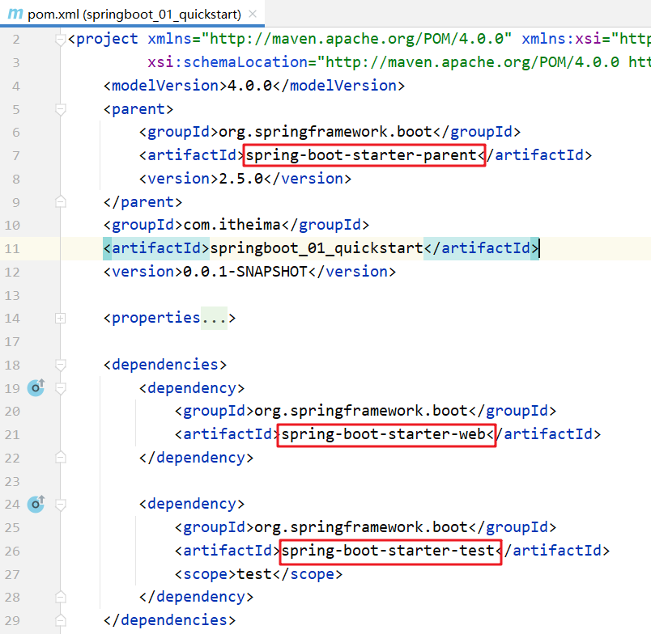
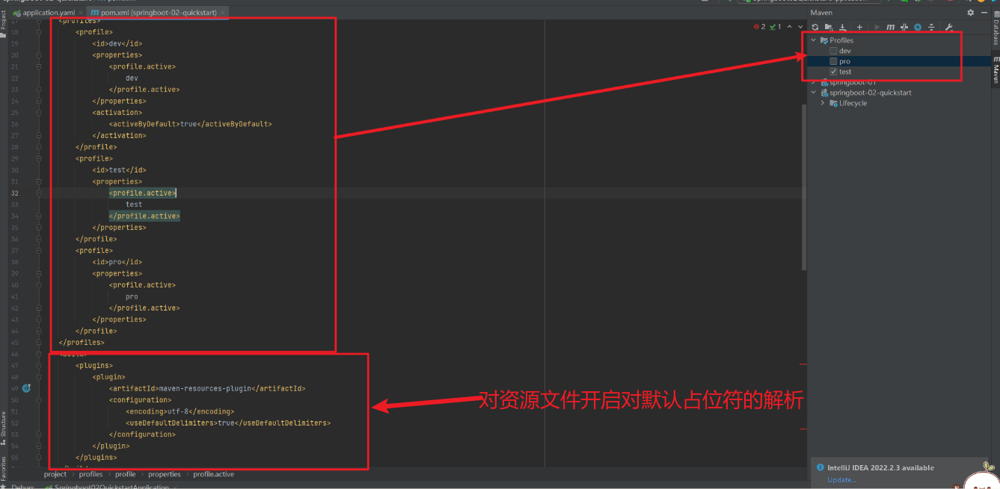

# SpringBoot搭建
## 步骤


## 起步依赖(_stater&pare)
    我们使用 `Spring Initializr`  方式创建的 `Maven` 工程的的 `pom.xml` 配置文件中自动生成了很多包含 `starter` 的依赖，如下图


    这些依赖就是==启动依赖==，接下来我们探究一下他是如何实现的。

    从上面的文件中可以看到指定了一个父工程，我们进入到父工程，发现父工程中又指定了一个父工程，如下图所示


    在进到父工程中，在该工程中我们可以看到配置内容如下图所示

    
    上图中的 `properties` 标签中定义了各个技术软件依赖的版本，避免了我们在使用不同软件技术时考虑版本的兼容问题。在 `properties` 中我们找 `servlet`  和 `mysql` 的版本如下图

    
    `dependencyManagement` 标签是进行依赖版本锁定，但是并没有导入对应的依赖；如果我们工程需要那个依赖只需要引入依赖的 `groupid` 和 `artifactId` 不需要定义 `version`。
    而 `build` 标签中也对插件的版本进行了锁定，如下图

    
    看完了父工程中 `pom.xml` 的配置后不难理解我们工程的的依赖为什么都没有配置 `version`。
### 辅助功能(Tomcat等)
    在spring-boot-start-web中我们会发现里面配置的是Tomcat服务器和web程序的依赖


### 打包
    在我们构建好的SpringBoot工程中pom.xml中配置了如下插件


    我们只需要使用maven的package指令打包就会在target目录下生成对应的jar包
    注意的是：
        该插件必须要配置，否则打好的jar包会有问题

```markdown
执行打包好的jar：jar -jar 打包好的jar包
```
```markdown
为什么打包好的jar包可以直接运行？
因为在springboot中配置了Tomcat服务器的插件，也就是辅助功能
```
### Tomcat是如何跟随springboot程序启动时一同运行的
```markdown
1. 在SpringApplication.run方法中，会调用刷新容器方法this.refreshContext()，
  在这个方法中，会调用createWebServer()方法，来拿到tomcat。如果是默认情况下会使用tomcat。
  在createWebServer中的getWebServer方法，拿到tomcat。
  在这个时候，实际上springboot仅仅是初始化了一个tomcat对象，在springboot的输出日志中也能观察到。
  在拿到了tomcat对象之后，会调用tomcat的start()方法。到这个时候tomcat才会启动。
2. 实际上tomcat就是以一个对象的方式，随着整个springboot程序来启动的。
```
### springboot容器替换
springboot 默认情况下有三个容器
- tomcat
- undertow
- jetty
- 默认情况下是tomcat
- 如果想要替换为其他容器的话，那需要先把你不使用的容器排除掉。默认是tomcat,写法如下
```xml
        <dependency>
            <groupId>org.springframework.boot</groupId>
            <artifactId>spring-boot-starter-web</artifactId>
            <exclusions>
                <exclusion>
                    <groupId>org.springframework.boot</groupId>
                    <artifactId>spring-boot-starter-tomcat</artifactId>
                </exclusion>
            </exclusions>
        </dependency>
```
    再加入我们要使用的容器
```xml
    <dependency>
        <groupId>org.springframework.boot</groupId>
        <artifactId>spring-boot-starter-jetty</artifactId>
    </dependency>
```
# 配置文件
## 三种配置文件
### properties配置
```properties
server.port=80
```
### yaml配置
### yml配置
    yaml和yml的配置写法一样
#### 语法
```yaml
# 大小写敏感
# 使用缩进表示层级关系
# 缩进的空格数目不重要，但是相同层级的元素必须左侧对齐 
# 参数值和冒号之间必须有空格
server:
  port: 8082
  servlet:
    context-path: /itheima
```
#### 数据格式
```yaml
# 纯量：单个的、不可再分的值（包括字符串字符串、布尔值、数值、Null、时间类型）
username: 'jack'

# 对象：键值对的集合，又称为映射（mapping）/ 哈希（hashes） / 字典（dictionary）
user:
  username: '张三'
  password: '123'
  
# 数组：一组按次序排列的值，又称为序列（sequence） / 列表（list）
addressList:
  - '北京'
  - '上海'
  - '广州'
```
### 优先级
```markdown
properties --->yml--->yaml
```
## 读取配置文件
```markdown
* 方式一: Environment（了解）
	此对象是Spring框架提供的，用来表示整个应用运行时的环境，可以读取配置文件中的属性值并逐个注入到Bean对象的对应属性中

* 方式二: @Value （了解）
	此注解是Spring框架提供的，用来读取配置文件中的属性值并逐个注入到Bean对象的对应属性中

* 方式三: @ConfigurationProperties(掌握) 
	此注解是SpringBoot框架提供的，用来快速、方便地将配置文件中的自定义属性值批量注入到某个Bean对象的多个对应属性中
```
### Environment(不怎么用)

### @Value(注意不是lombok下的)

### @ConfigurationProperties

    
    解除红色提示的方法
```xml
        <dependency>
            <groupId>org.springframework.boot</groupId>
            <artifactId>spring-boot-configuration-processor</artifactId>
            <optional>true</optional>
        </dependency>
```
    在使用的地方直接注入配置类

# 多环境配置

```yml
#各个测试环境用---来分割
spring:
  profiles:
    active: test #激活哪套环境
---
spring:
  profiles: test #测试环境
server:
  port: 80
---
spring:
  profiles: pro #生产
server:
  port: 81
---
spring:
  profiles: dev #开发
server:
  port: 82
```
    测试结果


    注意：
        在上面配置中给不同配置起名字的 `spring.profiles` 配置项已经过时。最新用来起名字的配置项是 
```yml
#开发
spring:
  config:
    activate:
      on-profile: dev
```
## 整合maven
    maven中配置

```xml
<profiles>
    <profile>
        <id>dev</id>
        <properties>
            <profile.active>
                dev
            </profile.active>
        </properties>
        <activation>
            <activeByDefault>true</activeByDefault>
        </activation>
    </profile>
    <profile>
        <id>test</id>
        <properties>
            <profile.active>
                test
            </profile.active>
        </properties>
    </profile>
    <profile>
        <id>pro</id>
        <properties>
            <profile.active>
                pro
            </profile.active>
        </properties>
    </profile>
</profiles>
<build>
<plugins>
    <plugin>
        <artifactId>maven-resources-plugin</artifactId>
        <configuration>
            <encoding>utf-8</encoding>
            <useDefaultDelimiters>true</useDefaultDelimiters>
        </configuration>
    </plugin>
</plugins>
</build>
```
    在springboot中application.yaml文件中应用maven属性
```yaml
#各个测试环境用---来分割
spring:
  profiles:
    active: ${profile.active} #激活哪套环境
---
spring:
  profiles: test #测试环境
server:
  port: 80
---
spring:
  profiles: pro #生产
server:
  port: 81
---
spring:
  profiles: dev #开发
server:
  port: 82
```
# 整合框架
## 整合SSM
### 依赖
    在pom.xml中书写
```xml
        <dependency>
            <groupId>com.alibaba</groupId>
            <artifactId>druid-spring-boot-starter</artifactId>
            <version>1.2.8</version>
        </dependency>

```
### 数据库连接
    在application.yml中书写数据库连接配置
```yml
spring:
  datasource:
    type: com.alibaba.druid.pool.DruidDataSource
    driver-class-name: com.mysql.cj.jdbc.Driver
    url: jdbc:mysql://localhost:3306/spring?serverTimezone=UTC
    username: root
    password: 123
```

### 实体类(book)
```java
package com.example.entity;

import lombok.AllArgsConstructor;
import lombok.Data;
import lombok.NoArgsConstructor;

/**
 * 实体类
 *
 * @author mhw
 * @since 2022/10/29 0:02
 */
@Data
@NoArgsConstructor
@AllArgsConstructor
public class Book {
    private Integer id;
    private String type;
    private String name;
    private String description;
}

```
### 表示层(controller)
```java

import com.example.entity.Book;
import com.example.service.BookService;
import org.springframework.beans.factory.annotation.Autowired;
import org.springframework.web.bind.annotation.GetMapping;
import org.springframework.web.bind.annotation.RequestMapping;
import org.springframework.web.bind.annotation.RestController;

import java.util.List;

/**
 * 会话层
 *
 * @author mhw
 * @since 2022/10/29 0:15
 */
@RestController
@RequestMapping("/books")
public class BookController {
    @Autowired
    private BookService bookService;

    @GetMapping
    public List<Book> finAll(){
        List<Book> list = bookService.finAll();
        return list;
    }
}
```
### 业务层(service)
    接口
```java
package com.example.service;

import com.example.entity.Book;

import java.util.List;

/**
 * 业务层
 *
 * @author mhw
 * @since 2022/10/29 0:20
 */
public interface BookService {
    List<Book> finAll();
}

```
    实现类
```java
package com.example.service.impl;

import com.example.dao.BookDao;
import com.example.entity.Book;
import com.example.service.BookService;
import org.springframework.beans.factory.annotation.Autowired;
import org.springframework.stereotype.Service;

import java.util.List;

/**
 * 实现类
 *
 * @author mhw
 * @since 2022/10/29 0:21
 */
@Service
public class BookServiceImpl implements BookService {

    @Autowired
    private BookDao bookDao;

    @Override
    public List<Book> finAll() {
        return bookDao.findAll();
    }
}
```
### 持久层(dao)
```java
package com.example.dao;

import com.example.entity.Book;
import org.apache.ibatis.annotations.Mapper;
import org.apache.ibatis.annotations.Select;

import java.util.List;

/**
 * 持久层
 *
 * @author mhw
 * @since 2022/10/29 0:22
 */
@Mapper
public interface BookDao {

    @Select("select * from tbl_book")
   List<Book> findAll();
}
```
```markdown
注意的是 dao中使用了@Mapper注解，该注解只有在springboot中使用，在springboot中spring读到这个注解的时候便会去对@select注解里面的内容
        相当于mybatis中包的扫描
```
## 单元测试
