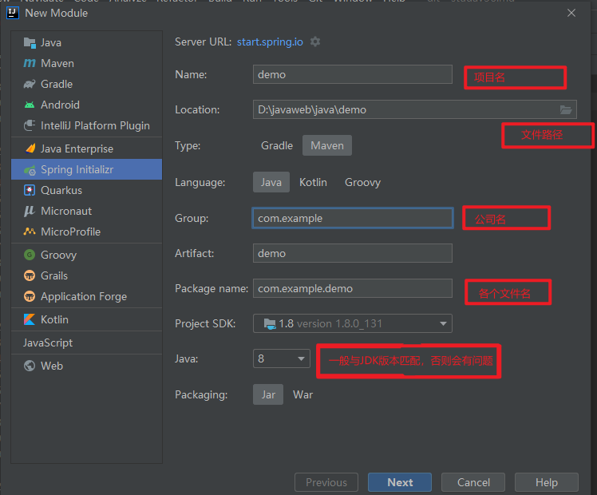
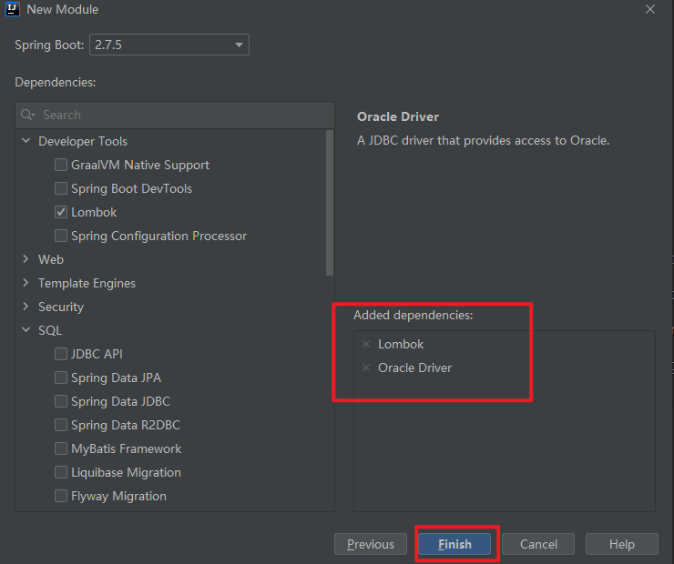
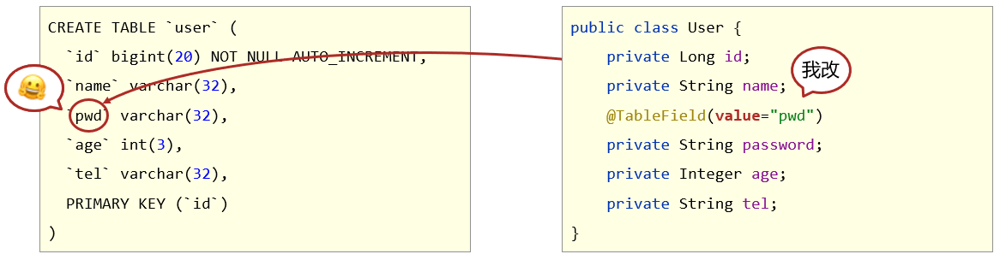
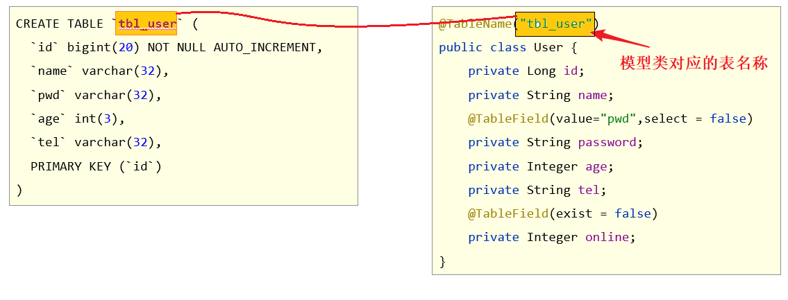
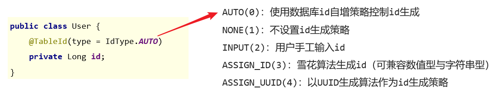
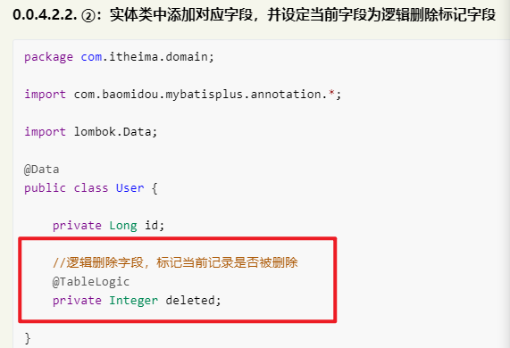
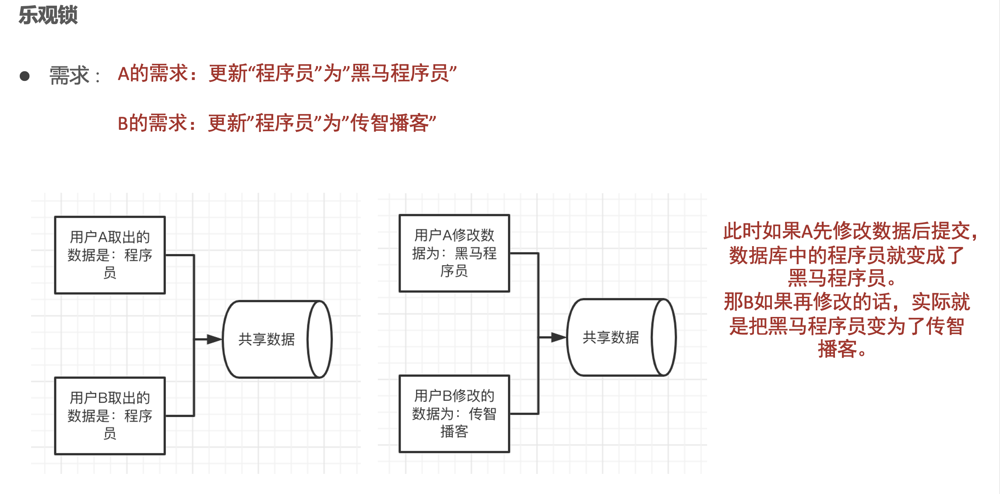
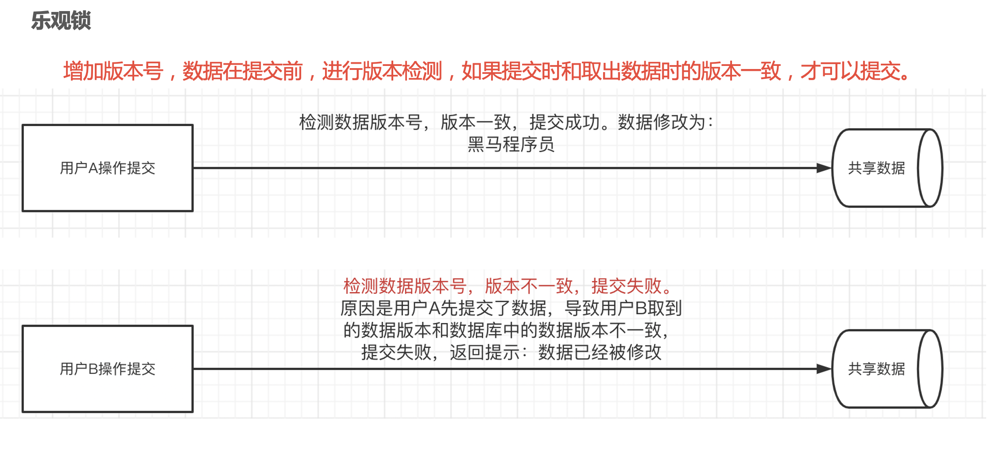
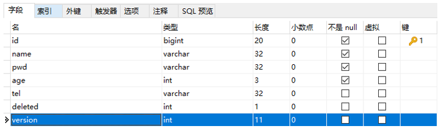

# MybatisPlus搭建
## 项目的创建


## MybatisPlus配置
    在项目的pom.xml中引入,因为在springboot容器中没有集成MP需要自己写入
```xml
<dependency>
    <groupId>com.baomidou</groupId>
    <artifactId>mybatis-plus-boot-starter</artifactId>
    <version>3.4.1</version>
</dependency>
<dependency>
    <groupId>com.alibaba</groupId>
    <artifactId>druid</artifactId>
    <version>1.1.16</version>
</dependency>
```
## 准备阶段
    数据库连接内容(在application.yml中书写)
```yml
spring:
  datasource:
    type: com.alibaba.druid.pool.DruidDataSource
    driver-class-name: com.mysql.cj.jdbc.Driver
    url: jdbc:mysql://localhost:3306/spring?serverTimezone=UTC
    username: root
    password: 123
```
    日志配置
```yml
spring:
  mybatis-plus:
    configuration:
      log-impl: org.apache.ibatis.logging.stdout.StdOutImpl
```
    实体类
```java
package com.itheima.entity;

import lombok.Data;

/**
 * 用户实体
 *
 * @author t3rik
 * @since 2022/10/29 10:27
 */
@Data
public class User {
    // 如果数据库中设置的bigint,在java代码中要用Long来接
    // 如果是integer,会超长
    private Long id;
    private String name;
    private String password;
    private Integer age;
    private String tel;
}
```
    持久层(mapper)
```markdown
只需要继承BaseMapper<>接口即可
```
```java
package com.itheima.mapper;

import com.baomidou.mybatisplus.core.mapper.BaseMapper;
import com.itheima.entity.User;
import org.apache.ibatis.annotations.Mapper;

/**
 * 用户mapper
 *
 * @author t3rik
 * @since 2022/10/29 10:29
 */
@Mapper
public interface UserMapper extends BaseMapper<User> {
}
```
    测试类
```java
@Slf4j //使用这个输出
@SpringBootTest //获取容器里面的内容的时候需要自己也在容器中
public class AppStartTest {
    @Autowired
    private UserMapper userMapper;
}
```


# 关于实体类中@TableField注解的解释
## value
    指定映射的数据库字段名
## el
    映射为原生 #{ ... } 逻辑，相当于写在 xml 里的 #{ ... } 部分。
## exist
    是否为数据库表字段，默认为 true。
## condition
    字段 where 实体查询比较条件，有值设置则按设置的值为准，没有则为默认全局的 %s=#{%s}
## update
    字段 update set 部分注入，例如：update="%s+1"：表示更新时会 set version=version+1（该属性优先级高于 el 属性）
## insertStrategy updateStrategy whereStrategy三个值的用法
```markdown
这三个值分别对应了增加，修改，对where条件字段的操作,都是关于 FieldStrategy类枚举 的内容
```
|值|描述|
|:-----:|:----:|
|IGNORED|忽略判断，该字段值不论是什么，都进行更新|
|NOT_NULL|不为null则更新，字段值为null则不更新该字段|
|NOT_EMPTY|不为空则更新，注意该字段值为null或为""(空字符串)都不会更新|
|DEFAULT|默追随全局配置，和IGNORED 中的配置保持一致|
|NEVER|不做更新操作，该字段值不论是什么，都不进行更新|
## select
    是否进行 select 查询，默认为 true。
## keepGlobalFormat
    是否保持使用全局的 format 进行处理，默认为 false。
## jdbcType
    JDBC类型 ，该默认值不代表会按照该值生效，默认为 JdbcType.UNDEFINED。
## typeHandler
    Class<? extends TypeHandler> 类型处理器，该默认值不代表会按照该值生效，默认为 UnknownTypeHandler.class。
## numericScale
    指定小数点后保留几位
## file
```markdown
字段自动填充策略，默认为 FieldFill.DEFAULT。
```
|值|描述|
|:-----:|:----:|
|DEFAULT|默认不处理|
|INSERT|插入填充字段|
|UPDATE|更新填充字段|
|INSERT_UPDATE|插入和更新填充字段|

# 使用MP常见的问题
    在MP中是区分大小写的，MP实体类大写等于_大写的小写，而数据库中不区分
## 表字段与实体类属性字段设计不同步

```markdown
采用@TableField(value = "数据库字段名")来解决
```
## 实体类中添加了数据库中为定义的属性

```markdown
采用@TableField(exist = false)来解决
```
## 采用默认查询开放了更多的字段查看权限

```markdown
采用@TableField(select = false)来解决，表示online字段不参与查询操作，与select()映射配置不冲突
```
## 表名与实体类名开发设计不同步

```markdown
采用TableName("数据库名")来操作
也可以采用全局配置
```
## 使用全局配置解决表名和id设置

```yml
mybatis-plus:
  global-config:
    db-config:
      #设置id生成方式
      id-type: assign_id
      #设置表名(当表名存在统一前缀的时候可以使用)
      table-prefix: tbl_
```
# 使用MP完成增加
    int insert = userMapper.insert(user);
    使用了insert()方法
```java
//添加
    @Test
    void  save(){
        User user = new User();
        user.setId(8L);
        user.setName("李四");
        user.setPassword("123");
        user.setAge(18);
        user.setTel("12456879");
        int insert = userMapper.insert(user);
        log.info(String.valueOf(insert));
    }
```
# 使用MP完成修改
    int update = userMapper.updateById(user);
    使用了updateById的方法
```java
@Test
    void update(){
        User user = new User();
        user.setId(8L);
        user.setName("张三");
        user.setPassword("456");
        user.setAge(18);
        user.setTel("123456");
        int update = userMapper.updateById(user);
        log.info(String.valueOf(update));
    }
```
# 使用MP完成删除
## 单挑删除
    在没有使用逻辑删除的时候是直接删除
```java
    //删除
    @Test
    void  delete(){
        userMapper.deleteById(8L);
    }
```
## 多条删除
```java
    //多条删除
    @Test
    void test012(){
        List<Long> list = new ArrayList<>();
        list.add(1402551342481838081L);
        list.add(1402553134049501186L);
        list.add(1402553619611430913L);
        userDao.deleteBatchIds(list);
    }
```
## 逻辑删除
### 数据库中添加逻辑字段标记字段

### 实体类中添加对应的字段，并设定当前字段为逻辑删除标记字段

### 在application.ym配置文件中添加
```yml
mybatis-plus:
  global-config:
    db-config:
      table-prefix: tbl_
      # 逻辑删除字段名
      logic-delete-field: deleted
      # 逻辑删除字面值：未删除为0
      logic-not-delete-value: 0
      # 逻辑删除字面值：删除为1
      logic-delete-value: 1
```
### 本质
```markdown
当添加了逻辑字段后。便不再进行真正的删除了，而是进行了修改操作，这样实行完后，查询也是查询不到的
```
# 使用MP完成查询
## 分页查询
### 设置分页拦截器作为spring管理的bean
```java
package com.itheima.config;

import com.baomidou.mybatisplus.extension.plugins.MybatisPlusInterceptor;
import com.baomidou.mybatisplus.extension.plugins.inner.PaginationInnerInterceptor;
import org.springframework.context.annotation.Bean;
import org.springframework.context.annotation.Configuration;

/**
 * 关于分页查询的配置类
 *
 * @author mhw
 * @since 2022/10/29 15:29
 */
@Configuration
public class mybatisPlusConfig {
    @Bean
    public MybatisPlusInterceptor mybatisPlusInterceptor(){
        //1、创建MybatisPlusInterceptor拦截器对象
        MybatisPlusInterceptor mybatisPlusInterceptor = new MybatisPlusInterceptor();
        //2、添加分页拦截器
        mybatisPlusInterceptor.addInnerInterceptor(new PaginationInnerInterceptor());
        return mybatisPlusInterceptor;
    }
}
```
### 执行分页查询
```java
    //分页
    @Test
    void testSelectPage(){
        //1代表页码，3代表条数
        IPage<User> pages = new Page<>(1,3);
        /*//页码
        pages.setCurrent(1);
        //条数
        pages.setSize(2);*/
        IPage<User> pageList = userMapper.selectPage(pages,null);
        log.info("记录 ===> {}", pageList.getRecords());
        log.info("分页总页数 ===> {}", pageList.getPages());
        log.info("总行数 ===> {}", pageList.getTotal());
    }
```
## 查询全部
    List<User> userList = userMapper.selectList(null);
    使用的是selectList()方法
```java
//查询所有
    @Test
    void getList() {
        List<User> userList = userMapper.selectList(null);
        for (User user : userList) {
            log.info(user.toString());
        }
    }
```
## 条件查询
    SELECT id,name,password,age,tel FROM user WHERE (age > ? AND age < ?)
```markdown
    方式一：按条件查询
          query.gt("age",9);
          query.lt("age",9);
            lt()方法：查询起始为0，末尾为9的范围内容的内容(小于)
            gt()方法：代表起始位置为9的(大于)
```
```java
@Test
    void test01(){
        //方式一：
        QueryWrapper<User> query = new QueryWrapper<User>();
        /*//常规写法
        query.gt("age",9);
        query.lt("age",18);*/
        //链式编程
        query.lt("age",9);

        List<User> users = userMapper.selectList(query);
        log.info("list===>{}",users);
    }
```
    方式二：lambda格式按条件查询
    query.lambda().gt(User::getAge,9).lt(User::getAge,18);相当于
```java
@Test
    void test02(){
        QueryWrapper<User> query = new QueryWrapper<>();
        query.lambda().gt(User::getAge,9).lt(User::getAge,18);
        List<User> users = userMapper.selectList(query);
        log.info("user===>{}",users);
    }
```
    lqw.gt(User::getAge,9).lt(User::getAge,18);
```java
    @Test
    void  test03(){
        //方式三：lambda格式按条件查询
        LambdaQueryWrapper<User> lqw = new LambdaQueryWrapper<User>();
        lqw.gt(User::getAge,9).lt(User::getAge,18);
        List<User> userList = userMapper.selectList(lqw);
        log.info(userList.toString());
    }
```
## 组合条件查询
### 并且关系(and)
    lqw.gt(User::getAge,9).lt(User::getAge,18);
    默认什么都不加的时候
```java
@Test
    void  test03(){
            //方式三：lambda格式按条件查询
            LambdaQueryWrapper<User> lqw = new LambdaQueryWrapper<User>();
        lqw.gt(User::getAge,9).lt(User::getAge,18);
        List<User> userList = userMapper.selectList(lqw);
        log.info(userList.toString());
        }
```
### 或者关系(or)
    lqw.lt(User::getAge, 10).or().gt(User::getAge, 30);
    要加入or()
```java
@Test
    void  test04(){
        LambdaQueryWrapper<User> lqw = new LambdaQueryWrapper<User>();
        //或者关系：小于10岁或者大于30岁
        lqw.lt(User::getAge, 10).or().gt(User::getAge, 30);
        List<User> userList = userMapper.selectList(lqw);
        log.info(userList);
}
```
## 查询投影(查询总数，平均值)
### 查询结果包含模型类中部分属性
```java
@Test
    void  test05(){
         LambdaQueryWrapper<User> wrapper = new LambdaQueryWrapper<>();
        // 查询投影.
        wrapper.select(User::getId, User::getName, User::getAge);
        List<User> users = userMapper.selectList(wrapper);
        log.info(users.toString());
        }
```
### 聚合查询(总数，平均值。最大值，最小值，求和)
    wrapper.select("count(*) as count"); //需要执行什么操作
    dao.selectMaps(wrapper); 使用了selectMaps()方法
```java
@Test
    void test06(){
        QueryWrapper<User> wrapper = new QueryWrapper<>();
        wrapper.select("count(*) as count");
        List<Map<String, Object>> maps = userMapper.selectMaps(wrapper);
        log.info(maps.toString());
        }
```
### 范围匹配
     wrapper.gt(User::getAge,18); gt：大于
     wrapper.lt(User::getAge,18);  lt:小于
     wrapper.between(User::getAge, 18, 28); between：之间
```java
    @Test
    void test08(){
        LambdaQueryWrapper<User> wrapper = new LambdaQueryWrapper<>();
         //1.大于
        wrapper.gt(User::getAge,18);
         //2.介于...之间
        wrapper.between(User::getAge, 18, 28);
        List<User> users = userMapper.selectList(wrapper);
        log.info("user ===> {}", users.toString());
    }
```
### 分组查询
        wrapper.select(User::getAge);//先进行查询
        wrapper.groupBy(User::getAge);//再进行分组
```java
@Test
    void test09(){
        LambdaQueryWrapper<User> wrapper = new LambdaQueryWrapper<>();
        wrapper.select(User::getAge);
        wrapper.groupBy(User::getAge);
        List<User> users = userMapper.selectList(wrapper);
        log.info("user ===> {}", users.toString());
    }
```
### 排序
    wrapper.orderBy(true, false, User::getAge);
    第一个参数值：用于指定当前这个条件是否有效；如果为 true，则应用当前条件；如果为 false，则忽略当前条件
    第二个参数值：true为升序，false为降序
    第三个参数值：按这个值来进行排序
```java
    @Test
    void test08(){
        LambdaQueryWrapper<User> wrapper = new LambdaQueryWrapper<>();
        wrapper.orderBy(true, false, User::getAge);
        List<User> users = userMapper.selectList(wrapper);
        log.info("user ===> {}", users.toString());
    }
```
### 包含性查询
    方式一：
    wrapper.in(User::getAge,18,20);
    方式二：
    wrapper.in(User::getAge, Arrays.asList(18,20));
```java
    @Test
    void test10(){
        LambdaQueryWrapper<User> wrapper = new LambdaQueryWrapper<>();
        //方式一：
        //wrapper.in(User::getAge,18,20);
        //方式二：
        wrapper.in(User::getAge, Arrays.asList(18,20));
        List<User> users = userMapper.selectList(wrapper);
        log.info("user ===> {}", users.toString());
    }
```
### 模糊查询
    wrapper.like(User::getName,"张");
    User::getName：按模型中的什么进行查询
    "张"：模糊查询的值
```java
    //模糊查询
    @Test
    void test07(){
        LambdaQueryWrapper<User> wrapper = new LambdaQueryWrapper<>();
        wrapper.like(User::getName,"张");
        List<User> users = userMapper.selectList(wrapper);
        log.info("user ===> {}", users.toString());
    }
```
## 多条查询
```java
    //多条查询
    @Test
    void test07(){
    //查询指定多条数据
    List<Long> list = new ArrayList<>();
        list.add(1L);
        list.add(3L);
        list.add(4L);
        userDao.selectBatchIds(list);
    }
```
## 逻辑删除以后的查询
```markdown
逻辑删除以后的查询，跟原来查询方式一样，不过不在查询删除了的那一条数据，但删除的数据本身数据库中是含有的
```
# 乐观锁
## 应用场景


## 步骤
### 数据库表中添加标记字段

### 实体类中添加对应字段，并设定当前字段为逻辑删除标记字段
```java
package com.itheima.domain;

import com.baomidou.mybatisplus.annotation.TableField;
import com.baomidou.mybatisplus.annotation.TableLogic;
import com.baomidou.mybatisplus.annotation.Version;
import lombok.Data;

@Data
public class User {

	private Long id;
	
    @Version
    private Integer version;
}
```
### 配置乐观锁拦截器实现锁机制对应的动态SQL语句拼装
```java
package com.itheima.config;

import com.baomidou.mybatisplus.extension.plugins.MybatisPlusInterceptor;
import com.baomidou.mybatisplus.extension.plugins.inner.OptimisticLockerInnerInterceptor;
import com.baomidou.mybatisplus.extension.plugins.inner.PaginationInnerInterceptor;
import org.springframework.context.annotation.Bean;
import org.springframework.context.annotation.Configuration;

@Configuration
public class MpConfig {
    @Bean
    public MybatisPlusInterceptor mpInterceptor() {
        //1.定义Mp拦截器
        MybatisPlusInterceptor mpInterceptor = new MybatisPlusInterceptor();

        //2.添加乐观锁拦截器
        mpInterceptor.addInnerInterceptor(new OptimisticLockerInnerInterceptor());
        
        return mpInterceptor;
    }
}
```
### 使用乐观锁机制在修改前必须先获取到对应数据的verion方可正常进行
```java
    @Test
    void testLock() {
        // 1. 接收前端传入的数据,使用这个数据
        // 2. 在数据库中取出与之对应的数据.
        // 3. 对比前端传入的数据和db中的数据
        // 4. 校验通过的话,更新数据.

        // 前端的数据
        User query = new User();
        query.setId(1L);
        query.setName("张三李四");
        query.setVersion(0);
        // db中的数据
        User user = dao.selectById(1L);
        if (!(query.getVersion().equals(user.getVersion()))) {
            log.info("该数据已经被他人修改,请刷新后再重试");
            return;
        }
        // 更新操作
        user.setName(query.getName());
        dao.updateById(user);
    } 
```
# 关于service和mapper的快速开发
## mapper封装
```markdown
在mybatisplus中，将mybatis简化到我们不在书写MySQL语句，只需要继承 BaseMapper<实体类> 接口
```
```java
package com.itmhw.mapper;

import com.baomidou.mybatisplus.core.mapper.BaseMapper;
import com.itmhw.entity.Employee;
import org.apache.ibatis.annotations.Mapper;

@Mapper
public interface EmployeeMapper extends BaseMapper<Employee> {
}

```
## service封装
```markdown
因为mybatisplus为持久层带来了简便，同时为业务层也带来了简便
在业务层service中也只需要继承两种接口即可
    - 接口要继承IService<实体类>
    - 实现类继承extends ServiceImpl<对应的持久层类, 实体类>，当然还得实现service接口类
```
    接口
```java
package com.itmhw.service;

import com.baomidou.mybatisplus.extension.service.IService;
import com.itmhw.entity.Employee;

public interface EmployService extends IService<Employee> {
}

```
    实现类
```java
package com.itmhw.service.impl;

import com.baomidou.mybatisplus.extension.service.impl.ServiceImpl;
import com.itmhw.entity.Employee;
import com.itmhw.mapper.EmployeeMapper;
import com.itmhw.service.EmployService;
import org.springframework.stereotype.Service;

@Service
public class EmployServiceImpl extends ServiceImpl<EmployeeMapper, Employee> implements EmployService {
}
```
# 关于MybatisPlus官方文档地址
[MybatisPlus官方文档](https://markdown.com.cn/basic-syntax/links.html)

